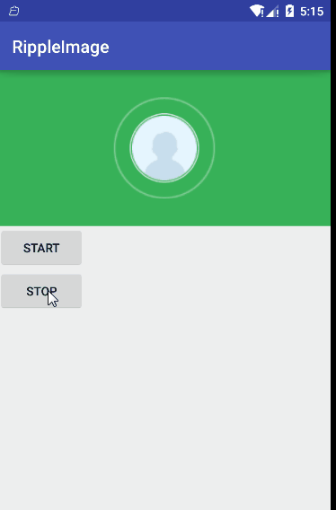

# RippleImageView
Android 自定义水波纹扩散ImageView

## 效果图

## 使用方法
1. **在xml里使用RippleImageView自定义控件：**
    
		xmlns:app="http://schemas.android.com/apk/res-auto"

		<com.army.rippleimage.RippleImageView
       		android:id="@+id/rippleImageView"
      		android:layout_width="match_parent"
       		android:layout_height="180dp"
       		android:background="#37B158"
       		app:show_spacing_time="800"//动画播放间隔时间
       		app:imageViewWidth="35dp"//图片的大小
       		app:imageViewHeigth="35dp"
       		android:layout_centerHorizontal="true">
    	</com.army.rippleimage.RippleImageView>

2. 在Activity中的使用：

     	rippleImageView=(RippleImageView)findViewById(R.id.rippleImageView);
     	//开始动画
     	rippleImageView.startWaveAnimation();

	 	  //停止动画
     	rippleImageView.stopWaveAnimation();

